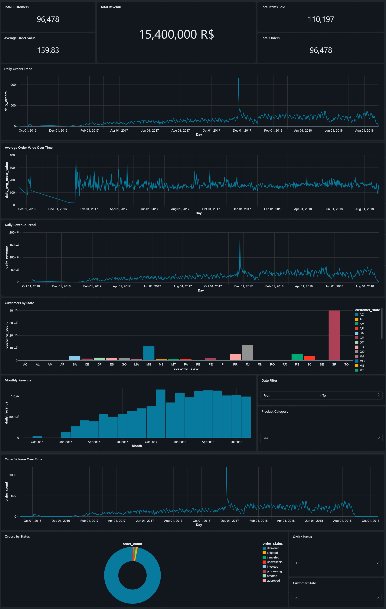

# Olist E-Commerce Data Pipeline

An end-to-end data engineering project built with Databricks and SQL to transform raw Olist e-commerce data into clean, reliable, and analytics-ready datasets.

## Project Overview

This project demonstrates a complete data engineering workflow using the Medallion Architecture:

**Bronze → Silver → Gold → Dashboard**

The pipeline starts with raw Olist e-commerce order data, applies data cleaning, deduplication, validation, and transformation, and produces business-ready datasets for analytics and reporting.

The final datasets are used to build an interactive Databricks dashboard that provides insights into sales, customers, orders, revenue, and purchasing behavior.

## Architecture

```text
Raw Olist E-Commerce Data
            ↓
        Bronze Layer
     Raw Data Ingestion
            ↓
        Silver Layer
   Cleaning & Data Quality
            ↓
         Gold Layer
 Business & Analytical Models
            ↓
      Databricks Dashboard
```

## Bronze Layer

The Bronze layer is the first stage of the data pipeline. It is responsible for ingesting the raw source data and preparing it for downstream processing.

### orders_bronze.sql

Handles the initial orders data ingestion and creates the foundation for the rest of the pipeline.

The Bronze layer preserves the raw information before applying cleaning and business transformations.

## Silver Layer

The Silver layer focuses on data cleaning, validation, standardization, and deduplication.

### orders_dedup.sql

Removes duplicate order records to ensure that orders are represented correctly and consistently.

### orders_silver.sql

Creates a cleaned and validated version of the orders data.

This layer applies data quality checks and prepares order information for analytical processing.

### order_items_silver.sql

Cleans and validates order item data, including product prices and freight values.

The Silver layer ensures that the data is reliable and consistent before it is used to create business-level metrics.

## Gold Layer

The Gold layer contains business-ready datasets designed for analytics, reporting, and dashboarding.

### daily_sales_gold.sql

Creates daily sales metrics used by the dashboard.

The dataset includes:

- Total orders
- Total customers
- Total items sold
- Product revenue
- Freight revenue
- Total revenue
- Average order value
- Daily sales activity

This dataset provides the main foundation for analyzing sales performance over time.

### customer_360_gold.sql

Creates a customer-level analytical dataset that provides a broader view of customer activity and purchasing behavior.

It includes:

- Customer location
- Total orders
- Total spending
- Average order value
- First order date
- Last order date
- Customer purchasing behavior

This dataset can be used for customer analysis, segmentation, and future analytics.

## Dashboard

The project includes an interactive Databricks dashboard designed to provide a clear business overview of the processed data.

The dashboard includes:

- Total Customers
- Total Revenue
- Total Items Sold
- Total Orders
- Average Order Value
- Daily Orders Trend
- Average Order Value Over Time
- Daily Revenue Trend
- Customers by State
- Monthly Revenue
- Order Volume Over Time
- Orders by Status

The dashboard also includes interactive filters for:

- Date
- Product Category
- Order Status
- Customer State

These visualizations make it easier to identify sales trends, understand customer distribution, monitor order activity, and evaluate overall business performance.



## Data Engineering Concepts

This project demonstrates several important data engineering concepts:

- ETL / ELT pipeline design
- Medallion Architecture
- Data ingestion
- Data cleaning
- Data deduplication
- Data quality validation
- Data transformation
- Business-level aggregations
- Analytical data modeling
- Dashboard development
- Git version control

## Technologies

- Databricks
- Databricks SQL
- SQL
- Delta Lake
- Medallion Architecture
- Git
- GitHub

## Repository Structure

```text
olist-ecommerce-databricks-pipeline/
│
├── dashboard/
│   └── dashboard.png
│
├── transformations/
│   ├── orders_bronze.sql
│   ├── orders_dedup.sql
│   ├── orders_silver.sql
│   ├── order_items_silver.sql
│   ├── daily_sales_gold.sql
│   └── customer_360_gold.sql
│
└── README.md
```

## Project Goal

The goal of this project is to demonstrate an end-to-end data engineering solution using Databricks, starting from raw e-commerce data and progressing through data ingestion, cleaning, quality validation, transformation, analytical modeling, and dashboard development.

The project demonstrates how raw transactional data can be transformed into reliable business datasets and meaningful visual insights using modern data engineering practices.
